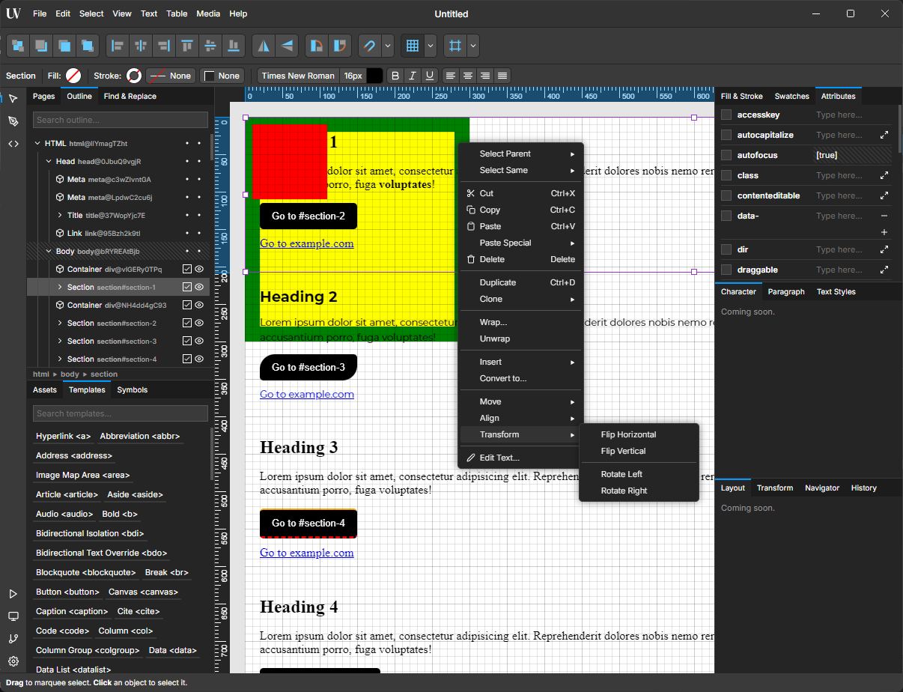

# Unwebber

Unwebber is an unrealistic non-beginner web editor.

Imagine a web editor that thinks like a graphic designer but speaks in web technologies. That's Unwebber - an unconventional approach to web development that breaks free from traditional constraints.

Unlike typical website builders, Unwebber is a sophisticated web editor that brings the familiar feel of professional design software to web development. Think Adobe Illustrator meets web technologies, but with the power to create fully functional web applications.

Just as Visual Studio Code transformed how we write code, analyze business data with Jupyter Notebook, write papers using LaTeX extension, create graphs using Graphviz, or write slide decks using Markdown, Unwebber aims to revolutionize how professionals interact with web technologies. Whether you're a designer, developer, or content creator, Unwebber bridges the gap between visual creativity and technical implementation.



## Status

Currently in early development. Stay tuned for updates.

## Use Cases

Unwebber opens up a world of possibilities for various creative and professional projects. Here are some intriguing use cases:
- Crafting a compelling company profile
- Showcasing a stunning user portfolio
- Designing an interactive presentation
- Facilitating dynamic brainstorming sessions
- Innovating in UI/UX design
- Creating eye-catching HTML5 ad banners

But that's not all. Imagine the potential for:
- Developing a business dashboard with real-time analytics
- Designing a simple yet engaging game

We're excited to hear your ideas and explore new horizons together!

## Backgrounds

Since its inception, the web has transformed from basic text documents into a sophisticated multimedia platform powering our digital world. It now drives everything from social networks and e-commerce to interactive games and streaming services. This evolution brought increasingly complex technologies, creating both opportunities and challenges for developers and content creators.

### Beyond Website Builders

<!-- Traditional website builders often lag behind web innovations, making users wait months for new features. Unwebber takes a different approach - directly exposing modern web technologies to users, enabling immediate access to cutting-edge capabilities. -->

Many people opt for website builders to establish their online presence. However, they often have limitations, particularly in leveraging advanced web technology. Users may have to wait months for new web technologies to be supported by the website builder. Even basic web technologies might not be available immediately, leaving users waiting while the company conducts research, planning, and development to implement the features, often prioritizing those that contribute to the company's revenue. Unwebber aims to expose as many as possible web technologies to users, allowing them to create websites with the latest web technologies.

### Community-driven Innovation

<!-- We believe in the power of community-driven innovation. Unwebber provides a platform where developers can create plugins, extensions, and themes, potentially building sustainable businesses around their contributions. This ecosystem approach accelerates development while creating opportunities for creators. -->

Community-driven innovation is often underutilized. When features don't justify immediate development costs, the power of open collaboration could fill the gap. Developers worldwide can create plugins, extensions, and themes, potentially building sustainable business models around their contributions. This approach not only accelerates feature development but also creates opportunities for creators to monetize their expertise. Unwebber aims to foster a vibrant community of developers, designers, and content creators, enabling them to collaborate and innovate together.

### Bridging Vision and Code

<!-- See a stunning gradient? Want to implement an intricate animation? With Unwebber, you can transform visual concepts into working code instantly, maintaining full access to modern web technologies without sacrificing creative control. -->

Despite the wealth of web development resources available today, from MDN Web Docs to CSS-Tricks, there's still a disconnect between inspiration and implementation. When you see a stunning gradient or an intricate animation, you can't simply grab and use it. Each visual concept must be translated into code manually, creating a barrier between inspiration and execution. Unwebber aims to eliminate this friction, transforming visual ideas into working code while maintaining the full power of modern web technologies.

## Limitations

While Unwebber empowers your creative journey in web development, it deliberately steps back from services like domain registration, hosting, SEO tools, content management, and security auditing.

Think of Unwebber as your creative companion, a powerful tool for transforming web development ideas into reality, while keeping the freedom to evolve your tech stack as needed. Future updates may introduce seamless integrations with popular services, but always as optional enhancements rather than dependencies.

## Contributing

The easiest way to contribute is to give feedback. You can also contribute by submitting bug reports, feature requests, or pull requests.

At the moment, it is not possible to contribute to the translation of the application. The project is still in the early development stage, and the translation system has not been implemented yet.

If you are a software engineer and want to run the project locally, you need to have Node.js installed. Clone the repository and run the following commands:

```sh
npm install
npm start
```

Voilà! Let's start hacking.

## Licenses

Licensed under GNU GPLv3. See [`LICENSE`](LICENSE) for details.

We use the following dependencies:
- [Electron](https://github.com/electron/electron), licensed under the MIT License
- [Electron Forge](https://github.com/electron/forge), licensed under the MIT License
- [Feather Icons](https://github.com/feathericons/feather), licensed under the MIT License

## Similars

In fact, when designing and developing, we have done some research on various solutions including:

- Webflow
- Framer
- Wappler
- Pinegrow
- Wix Studio
- Droip WordPress
- Adobe Dreamweaver
- Adobe Edge Animate
- Google Web Designer
- Tumult Hype

We're not affiliated with these applications but acknowledge their contributions to web development. Choose what works best for your needs and let's make the web a better place!
